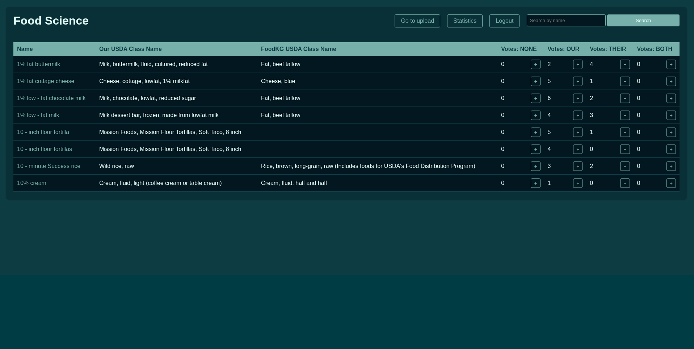
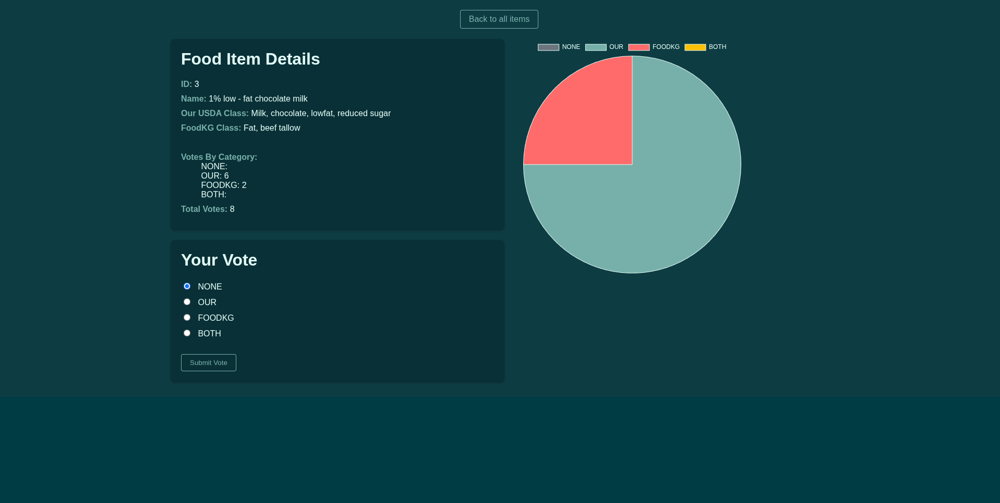
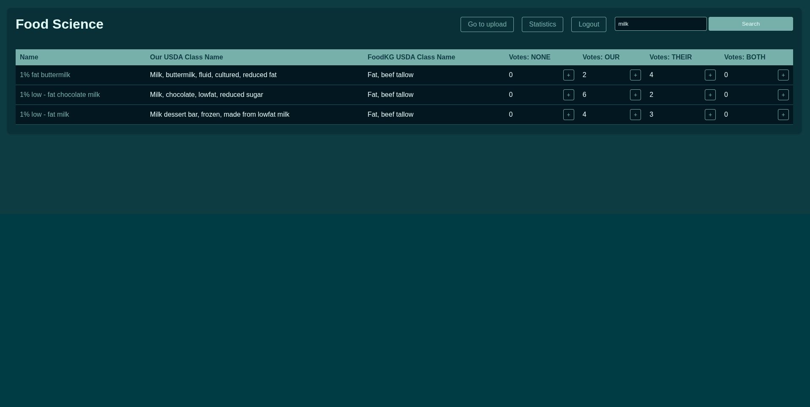
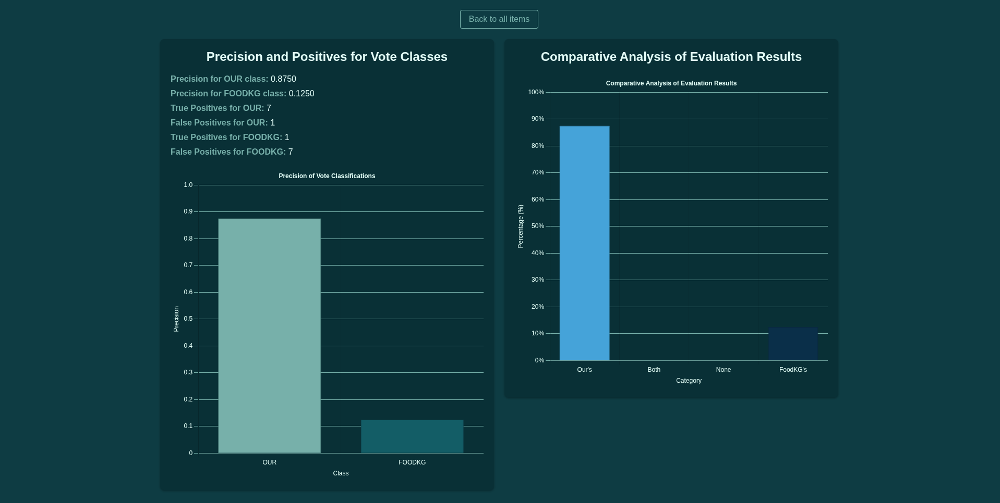
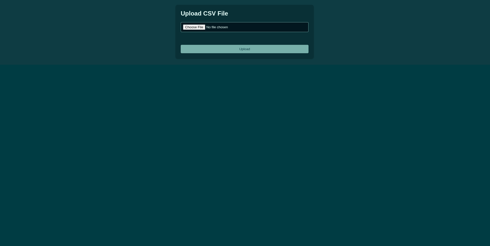

# Ontology Alignment Results

A Spring Boot web application for visualizing and voting on ontology alignment results with role-based access control.

## Features

- **Data Visualization**: Interactive charts and graphs displaying ontology alignment results
- **Voting System**: Expert users can vote on alignment quality
- **Role-Based Access**: Three-tier permission system (User, Expert, Admin)
- **CSV Upload**: Admin users can upload tab-separated CSV files with ontology data
- **Search Functionality**: Find specific ontology items quickly
- **Statistics Dashboard**: Comprehensive analytics and voting statistics

## User Roles & Permissions

### User
- View visualizations and statistics
- Browse all ontology items
- Search functionality

### Expert  
- All User permissions
- Vote on ontology alignments
- Contribute to alignment quality assessment

### Admin
- All Expert permissions  
- Upload CSV files with new ontology data
- Manage the dataset

## Quick Start

### Prerequisites
- Java 21
- Maven 3.6+

### Local Development
```bash
# Clone the repository
git clone <repository-url>
cd ontology_results_git

# Run the application
./mvnw spring-boot:run
```

Access the application at `http://localhost:8080/items/all`

## Application Screenshots

### Main Dashboard


### Data Visualization


### Search Interface  


### Statistics View


### CSV Upload (Admin Only)


## CSV Upload Guidelines

**Important**: CSV files must be **tab-separated**, not comma-separated, due to commas present in some ontology item names.

### Access Requirements
- Must have Admin role
- Navigate to `/upload` endpoint
- File format: `.csv` with tab separation

## Technology Stack

- **Backend**: Spring Boot 3.2.1
- **Frontend**: Thymeleaf templating
- **Database**: H2 (in-memory)
- **Security**: Spring Security with role-based access
- **Build Tool**: Maven
- **CSV Processing**: Apache Commons CSV
- **Testing**: JUnit, Selenium

## API Endpoints

- `GET /items/all` - View all ontology items (public)
- `GET /upload` - CSV upload form (admin only)
- `POST /upload` - Process CSV upload (admin only)
- `GET /summary` - Statistics dashboard (public)
- `GET /login` - Authentication page

## Configuration

- **Default Port**: 8080
- **Context Path**: `/`
- **Database**: H2 in-memory (development)
- **File Upload**: Max size configured in Spring properties

## Development

### Running Tests
```bash
./mvnw test
```

### Building for Production
```bash
./mvnw clean package
java -jar target/OntologyAlignmentResults-1.0-SNAPSHOT.jar
```
